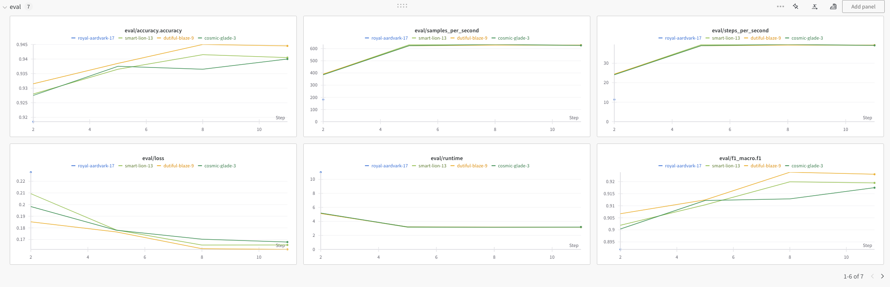
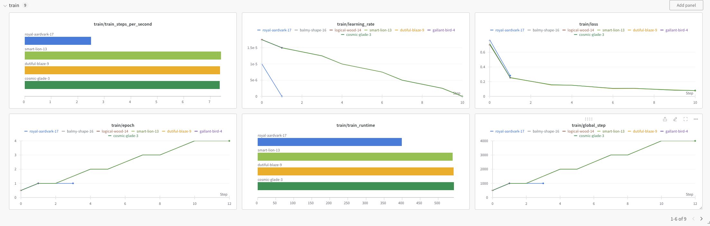
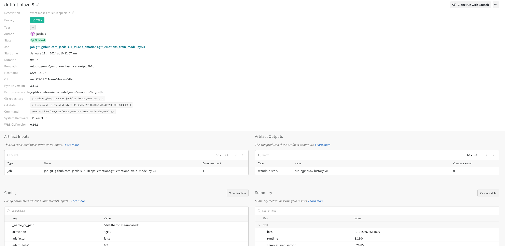
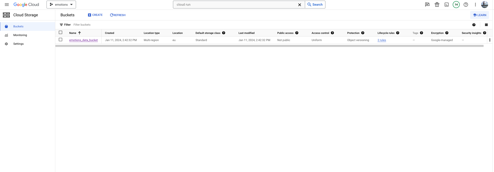
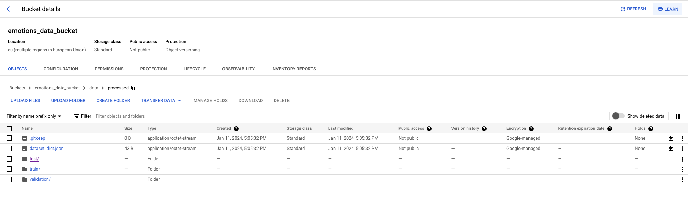
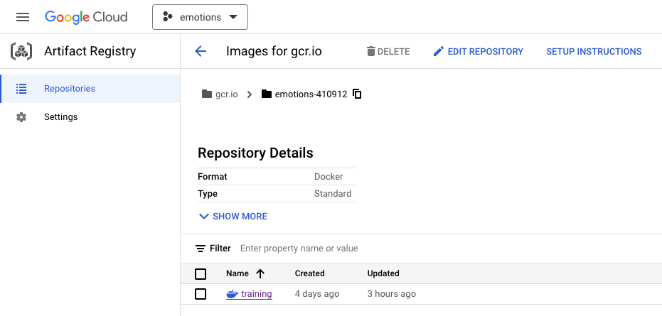
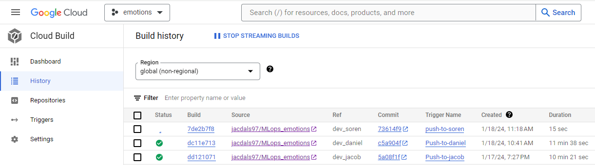
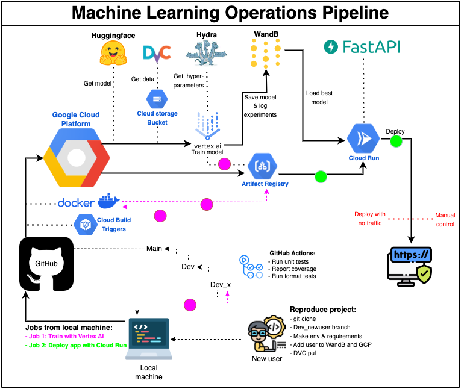

# Exam template for 02476 Machine Learning Operations

This is the report template for the exam. Please only remove the text formatted as with three dashes in front and behind
like:

```--- question 1 fill here ---```

where you instead should add your answers. Any other changes may have unwanted consequences when your report is auto
generated in the end of the course. For questions where you are asked to include images, start by adding the image to
the `figures` subfolder (please only use `.png`, `.jpg` or `.jpeg`) and then add the following code in your answer:

```markdown

```

In addition to this markdown file, we also provide the `report.py` script that provides two utility functions:

Running:

```bash
python report.py html
```

will generate an `.html` page of your report. After deadline for answering this template, we will autoscrape
everything in this `reports` folder and then use this utility to generate an `.html` page that will be your serve
as your final handin.

Running

```bash
python report.py check
```

will check your answers in this template against the constrains listed for each question e.g. is your answer too short, too long, have you included an image when asked to.

For both functions to work it is important that you do not rename anything. The script have two dependencies that can
be installed with `pip install click markdown`.

## Overall project checklist

The checklist is *exhaustic* which means that it includes everything that you could possible do on the project in
relation the curricilum in this course. Therefore, we do not expect at all that you have checked of all boxes at the
end of the project.

### Week 1

* [ check ] Create a git repository
* [ check ] Make sure that all team members have write access to the github repository
* [ check ] Create a dedicated environment for you project to keep track of your packages
* [ check ] Create the initial file structure using cookiecutter
* [ check ] Fill out the `make_dataset.py` file such that it downloads whatever data you need and
* [ check ] Add a model file and a training script and get that running
* [ check ] Remember to fill out the `requirements.txt` file with whatever dependencies that you are using
* [ check ] Remember to comply with good coding practices (`pep8`) while doing the project
* [ check ] Do a bit of code typing and remember to document essential parts of your code
* [ check ] Setup version control for your data or part of your data
* [ check ] Construct one or multiple docker files for your code
* [ check ] Build the docker files locally and make sure they work as intended
* [ check ] Write one or multiple configurations files for your experiments
* [ check ] Used Hydra to load the configurations and manage your hyperparameters
* [ check ] When you have something that works somewhat, remember at some point to to some profiling and see if
      you can optimize your code
* [ check ] Use Weights & Biases to log training progress and other important metrics/artifacts in your code. Additionally,
      consider running a hyperparameter optimization sweep.
* [ ] Use Pytorch-lightning (if applicable) to reduce the amount of boilerplate in your code

### Week 2

* [ check ] Write unit tests related to the data part of your code
* [ check ] Write unit tests related to model construction and or model training
* [ check ] Calculate the coverage.
* [ check ] Get some continuous integration running on the github repository
* [ check ] Create a data storage in GCP Bucket for you data and preferable link this with your data version control setup
* [ check ] Create a trigger workflow for automatically building your docker images
* [ ] Get your model training in GCP using either the Engine or Vertex AI
* [ check ] Create a FastAPI application that can do inference using your model
* [ ] If applicable, consider deploying the model locally using torchserve
* [ check ] Deploy your model in GCP using either Functions or Run as the backend

### Week 3

* [ ] Check how robust your model is towards data drifting
* [ ] Setup monitoring for the system telemetry of your deployed model
* [ ] Setup monitoring for the performance of your deployed model
* [ ] If applicable, play around with distributed data loading
* [ ] If applicable, play around with distributed model training
* [ ] Play around with quantization, compilation and pruning for you trained models to increase inference speed

### Additional

* [ check ] Revisit your initial project description. Did the project turn out as you wanted?
* [ check ] Make sure all group members have a understanding about all parts of the project
* [ check ] Uploaded all your code to github

## Group information

### Question 1
> **Enter the group number you signed up on <learn.inside.dtu.dk>**
>
> Answer:

Group 5

### Question 2
> **Enter the study number for each member in the group**
>
> Example:
>
> *sXXXXXX, sXXXXXX, sXXXXXX*
>
> Answer:

s240190, s161749, s164521

### Question 3
> **What framework did you choose to work with and did it help you complete the project?**
>
> Answer length: 100-200 words.
>
> Example:
> *We used the third-party framework ... in our project. We used functionality ... and functionality ... from the*
> *package to do ... and ... in our project*.
>
> Answer:

We used the third-party frameworks from Huggingface. First we found a suitable dataset for our project inside their Datasets collection. From here we chose to work with their Transformers framework that made it easy to load data, train a model and do inference. 

We used the following functionalities:
* Datasets: a powerful library that lets us load the data in a single line of code
* Autotokenizer: contains tokenizers for all of Huggingface's pretrained models
* Training Arguments: defines all the arguments that goes into training the model. We use it in combination with Hydra and Weights and Biasses to configure hyperparameters and manage experiments.
* Trainer: simplifies the training process of the model by taking care of creating dataloaders, optimizer, computing loss, performing training and prediction step and returning relevant metrics, among other things. It also integrates with Weights and Biasses for logging experiments.
* AutoModelForSequenceClassification: used together with from_pretrained() to make a class of the chosen pretrained classification model together with it's weights.
* Pipeline: organizes the inference by taking a model and tokenizer as input and returning a prediction. We have used the "text-classifcation" pipeline, which returns a label and a score when receiving text as input.

## Coding environment

> In the following section we are interested in learning more about you local development environment.

### Question 4

> **Explain how you managed dependencies in your project? Explain the process a new team member would have to go**
> **through to get an exact copy of your environment.**
>
> Answer length: 100-200 words
>
> Example:
> *We used ... for managing our dependencies. The list of dependencies was auto-generated using ... . To get a*
> *complete copy of our development environment, one would have to run the following commands*
>
> Answer:

We used Conda as a Package Manager to handle our dependencies and have created a requirements.txt and requirements_dev.txt file to store all relevant packages. For a new user to get a complete copy of our development environment, we have created a Makefile to easily set up the environment and install the packages necessary to run our code. To set everything up, a new user would simply have to run the following three commands in a Terminal:
* git clone https://github.com/jacdals97/MLops_emotions
* make create_environment
* make requirements
* make dev_requirements

We have also built a docker images that replicate the environment neccessary for training the model and serving the model.

### Question 5

> **We expect that you initialized your project using the cookiecutter template. Explain the overall structure of your**
> **code. Did you fill out every folder or only a subset?**
>
> Answer length: 100-200 words
>
> Example:
> *From the cookiecutter template we have filled out the ... , ... and ... folder. We have removed the ... folder*
> *because we did not use any ... in our project. We have added an ... folder that contains ... for running our*
> *experiments.*
> Answer:


We have filled out the following folders:
* .github/workflows: automates our workflows together with GitHub Actions
* tests: running unit testing on our code
* {{cookiecutter.repo_name}} OR emotions: actual code that loads and procceses the data, creates a model, trains the model and makes predictions.
* .dvc: data version control. Configured to work with storage in Google Drive or remote storage in Google Cloud. By default we use remote storage in Google Cloud.
* (data: Folder where the data is located immediately after being loaded and processed, and then later removed again locally once it is pushed to dvc.)
* dockerfiles: build images for training, prediction. We also store our cloudbuild files for building images in GCP here.
* reports: Folder to document the entire project.
        

and have furthermore added the following folders:
* config: Folder that contains a config file used to define hyperparameters and experiments that can then be called with Hydra.
* app: Containing code that creates the FastAPI application

while not using the following folders:
* hooks
* (data) see above
* notebooks
* icons
* docs
* models: We version models using Wandb


### Question 6

> **Did you implement any rules for code quality and format? Additionally, explain with your own words why these**
> **concepts matters in larger projects.**
>
> Answer length: 50-100 words.
>
> Answer:

We have set up GitHub Actions so that whenever something is pushed to the branches 'main' or 'dev', a format workflow is executed using Ruff which first checks the entire code and then automatically formats the code to be PEP8 compliant.

Formatting our is an extremely important task, especially when wotking on larger projects, in order for new users to understand what is going on so that they can reproduce the project, debug if they encounter errors and carry on developing. Tools like Ruff and GitHub Actions helps streamline the final project.

## Version control

> In the following section we are interested in how version control was used in your project during development to
> corporate and increase the quality of your code.

### Question 7

> **How many tests did you implement and what are they testing in your code?**
>
> Answer length: 50-100 words.
>
> Example:
> *In total we have implemented X tests. Primarily we are testing ... and ... as these the most critical parts of our*
> *application but also ... .*
>
> Answer:

In total we have implemented 14 tests that are testing the three critical components:
* test_data: Is data successfully loaded and processed? We test if the data exists, if it's being properly tokenized, and if all the labels are represented in the training data.
* test_model: Does model work? We create a random tensor and run it through the model to see if it's outputted in the correct size and format.
* test_train: Does the training code work? We test that it loads the correct model, receives arguments through Hydra, loads the data, computes the expected metrics.

### Question 8

> **What is the total code coverage (in percentage) of your code? If you code had an code coverage of 100% (or close**
> **to), would you still trust it to be error free? Explain you reasoning.**
>
> Answer length: 100-200 words.
>
> Example:
> *The total code coverage of code is X%, which includes all our source code. We are far from 100% coverage of our **
> *code and even if we were then...*
>
> Answer:

The total code coverage of code is 95%. The reason for the cover to only be 78% in train_model is that we are only testing that the model can access a few training arguments, such as hyperparamters defined with Hydra, and if that is successfull it is trivial to test for more.

| **Name**                      	| **Stmts** 	| **Miss** 	| **Cover** 	|
|-------------------------------	|-----------	|----------	|-----------	|
| emotions/__init__.py          	| 0         	| 0        	| 100%      	|
| emotions/data/__init__.py     	| 0         	| 0        	| 100%      	|
| emotions/data/make_dataset.py 	| 16        	| 1        	| 94%       	|
| emotions/models/__init__.py   	| 0         	| 0        	| 100%      	|
| emotions/models/model.py      	| 9         	| 0        	| 100%      	|
| emotions/train_model.py       	| 45        	| 10       	| 78%       	|
| tests/__init__.py             	| 4         	| 0        	| 100%      	|
| tests/test_data.py            	| 34        	| 0        	| 100%      	|
| tests/test_model.py           	| 17        	| 0        	| 100%      	|
| tests/test_train.py           	| 63        	| 0        	| 100%      	|
| TOTAL                         	| 240       	| 12       	| 95%       	|

Although we have a high total coverage percentage, it does not gurantee an error-free code, as the coverage is only as good as the quality of the tests that are executed.

### Question 9

> **Did you workflow include using branches and pull requests? If yes, explain how. If not, explain how branches and**
> **pull request can help improve version control.**
>
> Answer length: 100-200 words.
>
> Example:
> *We made use of both branches and PRs in our project. In our group, each member had an branch that they worked on in*
> *addition to the main branch. To merge code we ...*
>
> Answer:

We made use of both branches and pull requests in our project and created the following branch setup:
- main
-- dev
--- developer_1
--- developer_2
--- developer_3
That way each group member had their own development branch and could work on different parts of the project simultaneously. Whenever deemed relevant, we would make a pull request to the dev branch to merge our work together. When merging to the dev branch, we set up Github Actions to test the quality and functionality of the code being merged. Furthermore, we added branch protection to the main branch, in order to add an additional layer of quality control.


### Question 10

> **Did you use DVC for managing data in your project? If yes, then how did it improve your project to have version**
> **control of your data. If no, explain a case where it would be beneficial to have version control of your data.**
>
> Answer length: 100-200 words.
>
> Example:
> *We did make use of DVC in the following way: ... . In the end it helped us in ... for controlling ... part of our*
> *pipeline*
>
> Answer:
We made use of DVC to manage storage and versioning of the data. To get started, we initially stored the data in Google Drive and then later on organized dvc to work with a Bucket in Google Cloud Storage. To manage this we wrote a config file to easily switch between these different storage locations. At the end of the day, we did not have any updates to our dataset, thus we did not actively apply versioning on the data and DVC only worked as a large scale storage solution. However, DVC works well when different users want to test different data or make changes to data, so that they can do so without interferring with other's work. Data versioning could also be relevant in the future if we experience data drifting in our project, and want to update the underlying training data set with data from a different source.  


### Question 11

> **Discuss you continues integration setup. What kind of CI are you running (unittesting, linting, etc.)? Do you test**
> **multiple operating systems, python version etc. Do you make use of caching? Feel free to insert a link to one of**
> **your github actions workflow.**
>
> Answer length: 200-300 words.
>
> Example:
> *We have organized our CI into 3 separate files: one for doing ..., one for running ... testing and one for running*
> *... . In particular for our ..., we used ... .An example of a triggered workflow can be seen here: <weblink>*
>
> Answer:

We have used Git Workflow to control the quality of our code before it is deployed, in order to secure a good and smooth experience for the end users of the project or new developers interested in reproducing the project.

The continuous integration have been organized into two separate .yml files that execute specific events: one for doing unittesting and one testing the code format. We are running both the format tests and unittests for Ubuntu, Mac and Windows operating systems with Python version 3.11. The tests are triggered whenever something is pushed or has a pull_request to the main and dev branches. As it can take some time to install dependencies and get data from dvc whenever the tests are triggered, we have made use of caching our dependencies in GitHub to speed up this process. The unittests also return a coverage report, which shows how big a part of the code is being tested. An example of this triggered workflow can be seen in this link to our [Github-Actions] (https://github.com/jacdals97/MLops_emotions/actions/runs/7499996928/job/20417842206). This CI workflow ensures that our code is up to standard and that it is able to be run not only in our local environment, so that it is reproducable for new users.

## Running code and tracking experiments

> In the following section we are interested in learning more about the experimental setup for running your code and
> especially the reproducibility of your experiments.

### Question 12

> **How did you configure experiments? Did you make use of config files? Explain with coding examples of how you would**
> **run a experiment.**
>
> Answer length: 50-100 words.
>
> Example:
> *We used a simple argparser, that worked in the following way: python my_script.py --lr 1e-3 --batch_size 25*
>
> Answer:

To organize experiments with different set of hyperparameters and configureatins, we defined these in a .yaml file in a config folder. The desired experiment is then loaded using Hydra in our training script, so that training arguments such as batch size, epochs, learning rate and weight decay could be accessed by eg. writing:
```
learning_rate=cfg.hyperparameters.learning_rate
```
The config.yml file is then set up to work together with Weights and Biases (Wandb), so that the results (important metrics and plots) are stored with the exact experiments parameters each time an experiment is conducted. 


### Question 13

> **Reproducibility of experiments are important. Related to the last question, how did you secure that no information**
> **is lost when running experiments and that your experiments are reproducible?**
>
> Answer length: 100-200 words.
>
> Example:
> *We made use of config files. Whenever an experiment is run the following happens: ... . To reproduce an experiment*
> *one would have to do ...*
>
> Answer:

As already mentioned above, we made use of config files and Wandb to track our experiments and make them reproducible. An example could be that a new developer looks at the Wandb project and is interested in reproducing the experiment with the highest evaluation accuracy or lowest traing loss. By accessing that specific experiments, the user can then go to Overview to see the chosen hyperparameters and get a detailed overview of the results. The user can then define these specific hyperparamaters in the config.yaml file to reproduce the experiment. This is also shown in the images in Question 14 below.

### Question 14

> **Upload 1 to 3 screenshots that show the experiments that you have done in W&B (or another experiment tracking**
> **service of your choice). This may include loss graphs, logged images, hyperparameter sweeps etc. You can take**
> **inspiration from [this figure](figures/wandb.png). Explain what metrics you are tracking and why they are**
> **important.**
>
> Answer length: 200-300 words + 1 to 3 screenshots.
>
> Example:
> *As seen in the first image when have tracked ... and ... which both inform us about ... in our experiments.*
> *As seen in the second image we are also tracking ... and ...*
>
> Answer:

We have used Wandb in order to track the different experiments that have been carried out during the project. With it's interactive dashboards, user friendly interface, access to details and functionality to store modek outputs, Wandb was a good choice for this project

The first image shows the evaluation results of all the runs in Wandb. As it can be seen in the accuracy and loss graph, there is one experiment that out performs the others, "dutiful-blaze-9", with an evaluation accuracy of above 95% and loss below 0.16. Wandb is an interactive tool, so whenever you click on a run you are interested in knowing more about it will display much more information about that specific run. The thirs image below is an example of clicking on "dutiful-blaze-9".



The second image shows the training results, that compares metrics such as loss but also shows some chosen hyper parameters as well as computational results of the different experiments.



The third image below shows the Overview of the best performing experiment dutiful-blaze-9. In the overview, it is possible to see when the experiment was conducted, what user ran it as well as computational input and all the configurations of hyperparameters, models etc. This makes it easy to get an understanding of the experiment and use the same configurations to reproduce it. 



### Question 15

> **Docker is an important tool for creating containerized applications. Explain how you used docker in your**
> **experiments? Include how you would run your docker images and include a link to one of your docker files.**
>
> Answer length: 100-200 words.
>
> Example:
> *For our project we developed several images: one for training, inference and deployment. For example to run the*
> *training docker image: `docker run trainer:latest lr=1e-3 batch_size=64`. Link to docker file: <weblink>*
>
> Answer:

We use Docker to make our project reproducible and scalable, giving it a consistent environment so we're sure it will run the same way, not only locally on our computer, but for other users as well. To do so, we have developed two separate images: one for training and one for deployment. The training image sets up the base environment and configurations by installing the desired Python version and the required packages, and then starting a training run that ends up storing a model. The deployment image also sets up the desired environment and then loads the best performing model from Wandb and deploys it to a FastAPI application that is served on a simple webpage written in HTML. The deployment image is then pushed to a production environment in Google Cloud, ensuring that the model is running in a consistent environment.

The process is to first write a Docker file, then build the docker image by running the Docker file, and at last running the Docker image and thereby building a Docker Container:

Link to Docker file: https://github.com/jacdals97/MLops_emotions/blob/main/dockerfiles/train_model.dockerfile 
Build docker image: 
```
docker build -f train_model.dockerfile . -t trainer:latest
```
Run docker image: 
```
docker run --name experiment1 trainer:latest
```

### Question 16

> **When running into bugs while trying to run your experiments, how did you perform debugging? Additionally, did you**
> **try to profile your code or do you think it is already perfect?**
>
> Answer length: 100-200 words.
>
> Example:
> *Debugging method was dependent on group member. Some just used ... and others used ... . We did a single profiling*
> *run of our main code at some point that showed ...*
>
> Answer:

When we encountered bugs in the development of our code, we would usually follow this approach for debugging:
* Understanding the source of the bug by looking into error messages and red lines in VS Code
* If it is not an easy fix, google the problem, as someone has likely faced a similar issue and posted their solution online. [phind](https://www.phind.com/search?home=true) is a great AI search engine to help with this.
* If a solution is still not found, look into the source code of the package where the error occurs, as this can give a deeper understanding of what is necessary to build a work around.
* Run the code in chunks to better understand if the error occurs in connection with other parts of the code.

We did not apply profiling on the code, although the Transformer framework has their own build-in functionality for optimizing performance/run time.

## Working in the cloud

> In the following section we would like to know more about your experience when developing in the cloud.

### Question 17

> **List all the GCP services that you made use of in your project and shortly explain what each service does?**
>
> Answer length: 50-200 words.
>
> Example:
> *We used the following two services: Engine and Bucket. Engine is used for... and Bucket is used for...*
>
> Answer:

We used a variety of GCP services, such as:

* Buckets: a cost-effective cloud based storage solution that lets you store and manage large amounts of data. We used this in combination with dvc to also have version control of the data in Google Cloud.
* Artifact Registry: a single place in the cloud to manage container images and language packages, and allows users to set up automated pipelines. We  used artifact registry to store our Docker Images.
* Cloud Build: a powerfull tool to execute and automate builds in Google Cloud. In this project, Cloud Build was used by setting up automatic triggers for each developer and a manual trigger for final deployment.
* Vertex AI: a dedicated service for handling everything related to machine learning in the cloud. For this project, Vertex AI was used to train the model and store the output.
* Cloud Run: a compute platform that lets you run containers directly on top of Google's scalable infrastructure. For this project, Cloud Run was applied to build and render a web app to serve the model and interact with the users.

### Question 18

> **The backbone of GCP is the Compute engine. Explained how you made use of this service and what type of VMs**
> **you used?**
>
> Answer length: 100-200 words.
>
> Example:
> *We used the compute engine to run our ... . We used instances with the following hardware: ... and we started the*
> *using a custom container: ...*
>
> Answer:

We took advantage of the compute engine when we used Vertex AI to train the model. This worked by automatically creating a virtual machine with the specifications defined in a configuration file and executing the training docker image. One of the smart things about Vertex AI is that it automatically shuts down the virtual machine when the image has been executed, so that you don't spend unnecessary money. In order to run the training image with Vertex AI, the following command can be executed:

```
gcloud ai custom-jobs create \
    --region=europe-west2 \   
    --display-name=<run_name> \
    --config=vertex_ai_config.yaml
```

The config.yaml file specifies the desired hardward, among other things. We have primarily trained on the 'n1-highmem-2' CPU, as it took several days to get a quota approved for using the 'N1-standard-8 NVIDIA_TESLA_T4' GPU

### Question 19

> **Insert 1-2 images of your GCP bucket, such that we can see what data you have stored in it.**
> **You can take inspiration from [this figure](figures/bucket.png).**
>
> Answer:




### Question 20

> **Upload one image of your GCP container registry, such that we can see the different images that you have stored.**
> **You can take inspiration from [this figure](figures/registry.png).**
>
> Answer:



### Question 21

> **Upload one image of your GCP cloud build history, so we can see the history of the images that have been build in**
> **your project. You can take inspiration from [this figure](figures/build.png).**
>
> Answer:



### Question 22 

> **Did you manage to deploy your model, either in locally or cloud? If not, describe why. If yes, describe how and**
> **preferably how you invoke your deployed service?**
>
> Answer length: 100-200 words.
>
> Example:
> *For deployment we wrapped our model into application using ... . We first tried locally serving the model, which*
> *worked. Afterwards we deployed it in the cloud, using ... . To invoke the service an user would call*
> *`curl -X POST -F "file=@file.json"<weburl>`*
>
> Answer:

We developed the app locally using FastAPI and websockets, building on top of code found [here] (https://fastapi.tiangolo.com/vi/advanced/websockets/). We added the predict functionality using the previously trained model, which we load from Wandb. 

For deployment we build the docker image locally, tag it and push it to the Artifact Registry on GCP. 
In the cloud using GCP's Cloud Run service, we deployed the model. Several settings were changed from the defaults to ensure that the app would run:
* Allocate enough memory for the large image (3GB)
* Reduce the max number of instances allowed, since each instance needs enough memory to contain the image
* Allow unauthenticated invocation (our company has plenty of ressources, so top management does not mind it if people outside the company use the service)
* Set request timeout to the maximum of 3600 seconds. Sometimes the websocket framework might close if the request timeout is too low. 

The application can be accessed vis this [link](https://my-fastapi-o3qqudwy2q-ew.a.run.app). The users simply write in a text, which can be a comment on Twitter, Trustpilot, Tripadvisor or from other social media and business review platforms. The application then returns the emotion of the text with a predicted probability. 

### Question 23

> **Did you manage to implement monitoring of your deployed model? If yes, explain how it works. If not, explain how**
> **monitoring would help the longevity of your application.**
>
> Answer length: 100-200 words.
>
> Example:
> *We did not manage to implement monitoring. We would like to have monitoring implemented such that over time we could*
> *measure ... and ... that would inform us about this ... behaviour of our application.*
>
> Answer:

All models become outdated over time. We considered setting up a monitoring system that logs the inputted text strings along with a "satisfaction score", for example through a red-yellow-green button. Our emotion prediction model could become outdated in several ways. For instance, data drifting could result in that our model generalizes worse over time. Imagine, that the consultants begin to use the emotions prediction model for text strings coming from a source that is different in nature from the Tweets the model was trained on. This could be the case if they recieve some more formally written reviews/complaints/comments from a client and then wish to use the model - trained on often informally written tweets - and apply the model on these more formally written reviews/complaints/comments.

By setting up a monitoring system and analyzing the collected data, we would be able to catch this in the early stages and make appropriate changes, for example by adding more formally written text into the training data and retraining the model, or simply building a different service for that type of business scenario. 

### Question 24

> **How many credits did you end up using during the project and what service was most expensive?**
>
> Answer length: 25-100 words.
>
> Example:
> *Group member 1 used ..., Group member 2 used ..., in total ... credits was spend during development. The service*
> *costing the most was ... due to ...*
>
> Answer:

At the time of writing (Jan. 17, 3pm), 133 DKK were spent on Google Cloud. Tho cost was primarily driven by Artifact Registry, followed by Vulnerability Scanning and training with Vertex AI. In our setup, we push a training image to the artifact registry each time a developer commits changes from local to the developers branch. This is done so that training is possible on GPUs for all developers independently, but comes with the cost of building and sending multiple images to the cloud.  

## Overall discussion of project

> In the following section we would like you to think about the general structure of your project.

### Question 25

> **Include a figure that describes the overall architecture of your system and what services that you make use of.**
> **You can take inspiration from [this figure](figures/overview.png). Additionally in your own words, explain the**
> **overall steps in figure.**
>
> Answer length: 200-400 words
>
> Example:
>
> *The starting point of the diagram is our local setup, where we integrated ... and ... and ... into our code.*
> *Whenever we commit code and puch to github, it auto triggers ... and ... . From there the diagram shows ...*
>
> Answer:



The starting point of this project's machine learning operations pipeline is the connection between the local setup and GitHub. Through GitHub, several branches are created for different purposes. The lowest level branch is Dev_x where each developer has their own development branch to write code and run tests. The next level is the Dev branch, where each developers advancement are being merged and GitHub Actions runs a variety of tests to secure the quality of the code. The highest level branch is main from where the final project is deployed.

Whenever a developer pushes to their local branch, a Google Cloud Build Trigger is activated, building a Docker training Image and storing it in Artifact Registry. From Artifact Registry, GCP's machine learning service, Vertex AI, can take the training container and train the model. This is done by manually running a job from your local setup. To do so, it also connects to Huggingface to get a Transformer model, it connects to a Cloud Storage Bucket to get versionized data and it connects to Hydra to get hyperparameters. Whenever Vertex AI is done training, the trained model is saved to WandB together with information about hyper parameters, metrics and the user who ran the job.

At last, a manual trigger let's the user deploy the model into a web application created by FastAPI. When doing so, a Docker prediction Image is build and stored in Artifact Registry and the best performing model is loaded from WandB. A final control is then carried out before directing traffic to the web app in order to see that everything works as expected.

The flowchart also shows how a new user/developer would reproduce the project and get up to speed.


### Question 26

> **Discuss the overall struggles of the project. Where did you spend most time and what did you do to overcome these**
> **challenges?**
>
> Answer length: 200-400 words.
>
> Example:
> *The biggest challenges in the project was using ... tool to do ... . The reason for this was ...*
>
> Answer:

We faced several challenges during the project, but none that we were not able to overcome in cooperation with each other. One challenge was the fact that we never got a GPU quota for Vertex AI approved by GCP, which meant that training our model was a quite slow process. We also faced several challenges with respect to Docker, as building an image would take up a lot of local disk space and be quite slow when installing requirements. We also spend quite a lot of time making Docker work smoothly together with DVC and Cloud Build.

Throughout the project, as many topics were new to us, we sometimes felt that we were missing some best practice tips, e.g. on how to handle model versioning. In the end we stored our models in Weights and Biases as we encountered issues on accessing models from GCP Buckets, which did not work together with Huggingface's Transformer framework. When we then stored the models in Weights and Biases, we would like to have had more practice with accessing the best performing models in an automated fashion. 

We also encountered some doubts in regards to the CI/CD setup in the Google Cloud Platform, where we were also missing some best practice tips. As training locally on some of our computers, we wanted to automatically build a training image when each of us pushed our local development branches, so that we could submit a Vertex AI job and train on a virtual machine. To do so we created several Cloud Build Triggers. However, this was a major cost driver, and at the end of the day was probably not the best approach as a training image would be constructed whenever we pushed a simple change such as an update to a read_me file. 


### Question 27

> **State the individual contributions of each team member. This is required information from DTU, because we need to**
> **make sure all members contributed actively to the project**
>
> Answer length: 50-200 words.
>
> Example:
> *Student sXXXXXX was in charge of developing of setting up the initial cookie cutter project and developing of the*
> *docker containers for training our applications.*
> *Student sXXXXXX was in charge of training our models in the cloud and deploying them afterwards.*
> *All members contributed to code by...*
>
> Answer:

On a general note, all team members worked together throughout the entire project and supported each other across all the different tasks. However, to ensure a smooth and quick development, each member worked primarily with the following topics:

s240190:
* Set up model training and inference with connections to Huggingface and Wandb
* Set up Github repository with Cookiecutter template as well as Github Actions, Workflows and Triggers
* Build Docker images and push them to Artifact Registry
* Train model with Vertex AI
* Connect DVC to the Docker Images

s161749:
* Create web application with Fast API and HTML code
* Deploy the web application with Cloud Run
* Set up the entire Google Cloud Platform Project and manage this

s164521:
* Load and process data from Huggingface
* Configure hyperparameters with Hydra
* Write unit tests
* Report writing